# Aura Sound

A sleek, premium, and feature-rich local music player application built with Flutter, designed exclusively for iOS and Android. It scans, indexes, and plays local audio files with a modern UI, dynamic app icon switcher, and full background playback controls.

---

## 📱 About the App

**Aura Sound** is a high-performance local music playback application. The app leverages native capabilities to query local files and delivers an immersive listening experience. Using a robust state management pattern and native media controls, it allows users to enjoy their local music libraries seamlessly.

---

## 📸 Screenshots

### 🎵 Core Experience
<p align="center">
  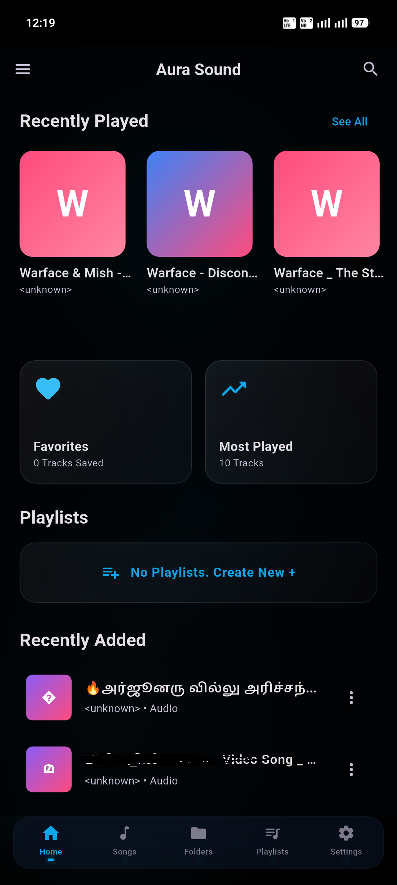
  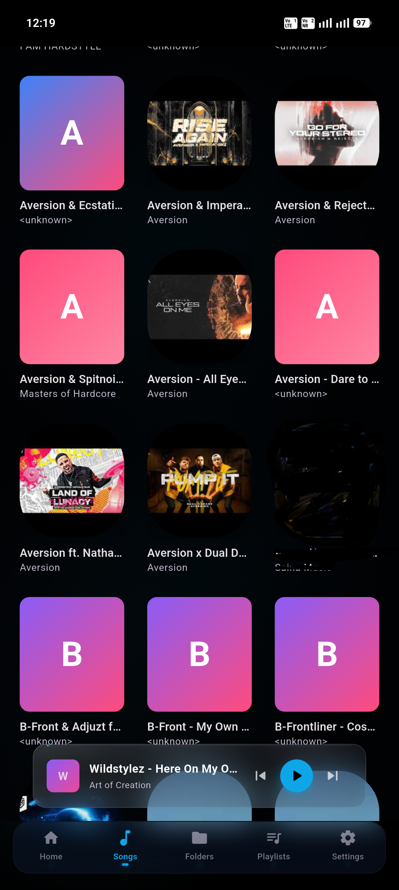
  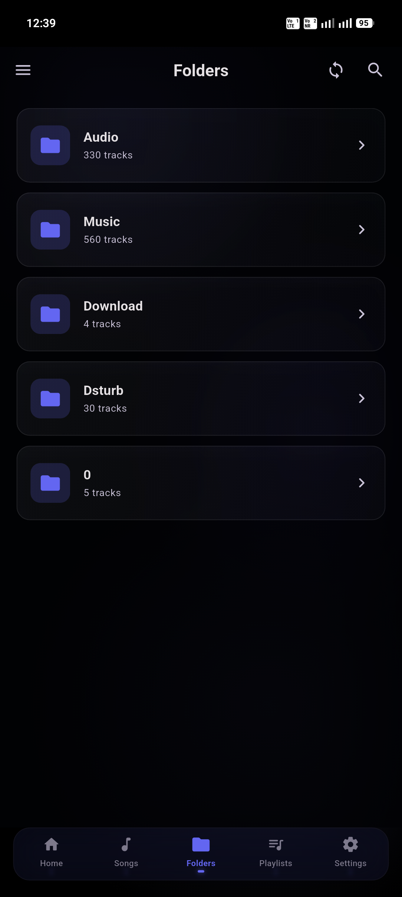
   
  
 </p>

 ### 🎉 Playlist& Search
<p align="center">
  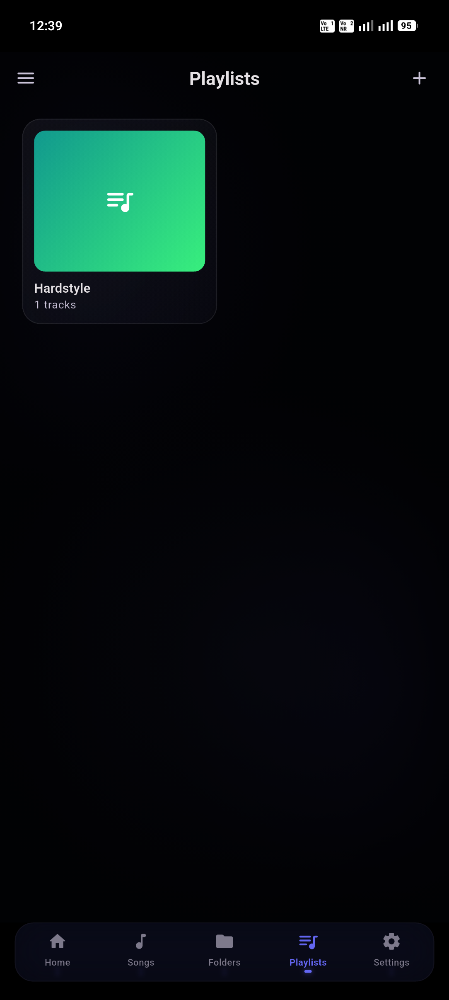
  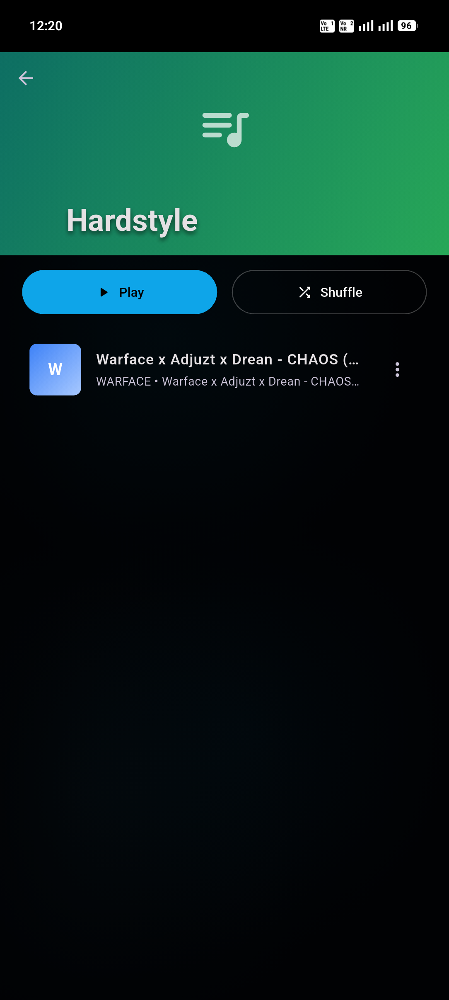
 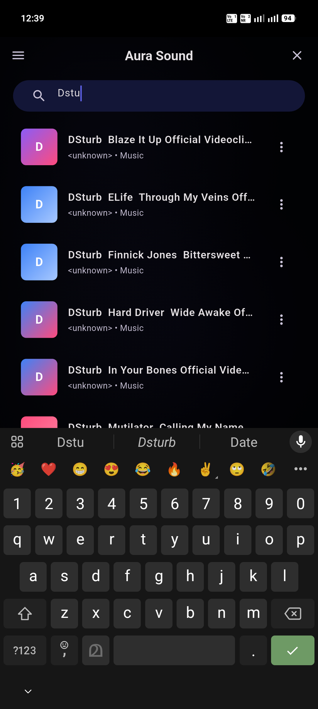
</p>

### 🎧 Now Playing & Queue
<p align="center">
  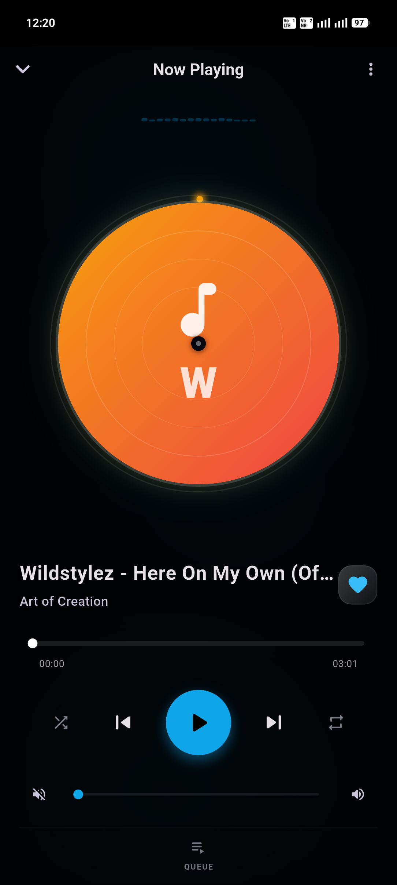
  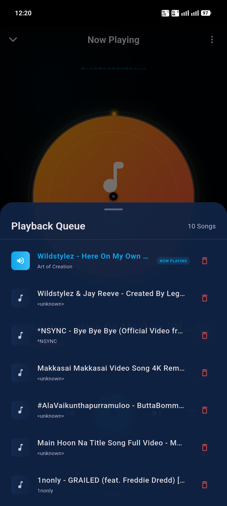
  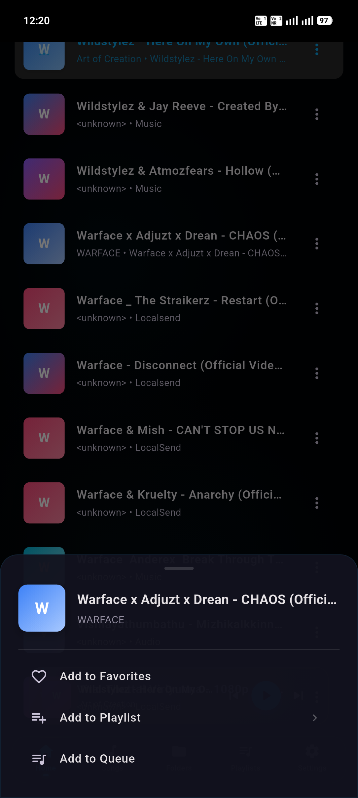
</p>

### 🎨 Settings & Customization
<p align="center">
  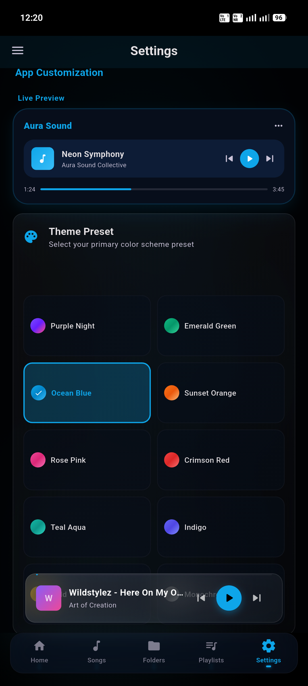
  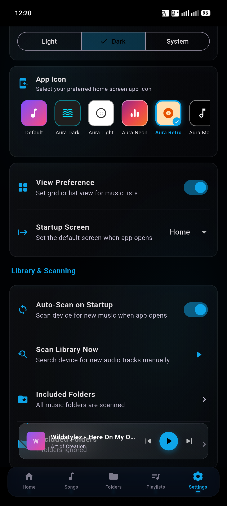
  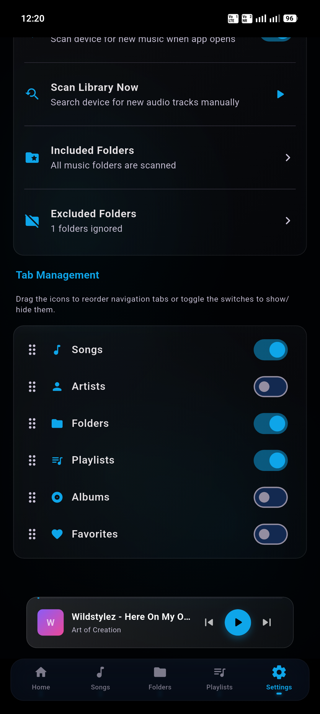
</p>


---

## ✨ Features

### 🎵 Core Audio Playback
- **Premium Playback Engine:** Powered by `just_audio` for high-fidelity audio playback.
- **Background Controls:** Fully integrated with `audio_service` to provide lock screen media controls, notifications, and headset event handlers.
- **Advanced Player Controls:** Play, pause, skip forward/backward, seek, shuffle, and repeat modes.
- **Native Volume Control:** Controls native system volume and listens to volume changes using `flutter_volume_controller`.

### 🎨 Premium Customization
- **Dynamic App Icons:** Switch the home screen app icon directly from the settings page! Choose between 6 minimal and modern icons:
  - **Aura Default**: Premium aura glowing circle with waveform logo.
  - **Aura Dark**: Sleek dark theme with glowing cyan accents.
  - **Aura Light**: Elegant clean white background with black soundwave circle.
  - **Aura Neon**: Vibrant neon purple, pink, and orange gradient.
  - **Aura Retro**: Vintage vinyl record deck design.
  - **Aura Mono**: High-contrast black and white musical note outline.
- **Accent Theme Colors:** Choose from signature accent colors (Lavender, Fluid Blue, Aura Pink, Emerald, Amber) to customize the application theme.
- **Theme Mode Selector:** Smooth switching between Light Mode, Dark Mode, and System Default theme.

### 🗃️ Music Library & Navigation
- **Local Scan:** Auto-scans local storage for media files (`on_audio_query`) and parses metadata like title, artist, album, and artwork.
- **Smart Categorization:** Organize and view music by:
  - **Songs:** View a master list of all scanned tracks.
  - **Albums:** Grouped by album name with custom album art.
  - **Artists:** Grouped by performer metadata.
  - **Folders:** Browse physical directories on the device's storage containing audio files.
- **Playlists:** Create, update, and manage custom playlists.
- **Favorites:** Easily bookmark tracks to access them in a dedicated favorites list.
- **Playback History:** Track and view your recently played tracks.

### ⚙️ UX & System Details
- **Material 3 Design:** A modern, clean, and responsive user interface.
- **Permission Handler:** Streamlined permission request flows for storage access.
- **Persistent State:** Preferences, favorites, history, and selected app icon are saved locally.

---

## 🛠️ Architecture & Tech Stack

- **Framework:** [Flutter](https://flutter.dev) (targeted to Android & iOS)
- **State Management:** [Flutter BLoC](https://pub.dev/packages/flutter_bloc) / Cubit for predictable, testable state handling.
- **Service Locator:** [GetIt](https://pub.dev/packages/get_it) for dependency injection.
- **Dynamic Launcher Icons:** [flutter_dynamic_icon_plus](https://pub.dev/packages/flutter_dynamic_icon_plus) (compatible with AGP 9 and modern Gradle)
- **Audio Stack:**
  - `just_audio` (Playback)
  - `audio_service` (System integration)
  - `flutter_volume_controller` (Volume control)
- **Metadata Querying:** `on_audio_query` (Scanning local device audio assets)
- **Local Storage:** `shared_preferences` 

---

## 🚀 Getting Started

### Prerequisites
1. Install [Flutter SDK](https://docs.flutter.dev/get-started/install).
2. Setup target emulators/devices (Android SDK / Xcode).

### Running the App
1. Clone the repository.
2. Get dependencies:
   ```bash
   flutter pub get
   ```
3. Run the application:
   ```bash
   flutter run
   ```

### Building for Release

#### Android (APK & AppBundle)
```bash
flutter build apk --release
flutter build appbundle --release
```
> [!NOTE]
> Since dynamic app icon switching uses Android `<activity-alias>`, you must do a `flutter clean` before compiling a release build if alternate icon configs are modified.
